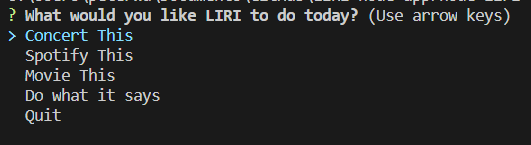
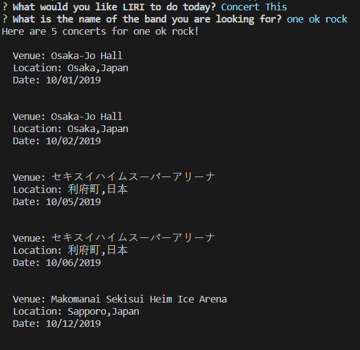
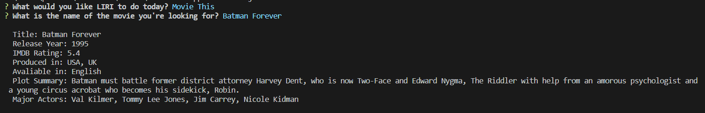
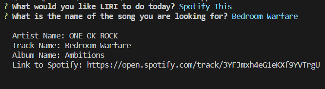

# LIRI Node App

## Author

Peter Wu

## Description

The following node applet is run through the command line to allow the user to look for:

- Concerts via BandCamp API
- Movies info via omdb API
- Songs via spotify API

The applet can also allow the user to use a random.txt file to run through one of the pre-defined LIRI commands.

## Running the Program

### Requirements

The LIRI program uses all of the following node.js packages

- dotenv
- axios
- moment
- fs
- Spotify
- inquirer

### Installation

To use the LIRI node app, the user must create a ".env" file with the following code.

``` plainText
# Spotify API keys
SPOTIFY_ID = [Your ID here]
SPOTIFY_SECRET = [Your Secret Key here]


# AXIOS keys
MOVIEOMDB_APIKEY = [Your OMDB API key here]
BANDSINTOWN_APIKEY = [Your Bands in town API KEy]
```

Please also run `npm i` or `npm install` to download all of the dependencies for LIRI to run properly.

## Running the Application

### Landing screen



On the landing screen, the user is allowed to pick from the following items using the arrow keys.
currently, there are only 4 options besides quit, though more will be added later.

### Concert This



Running concert this will return at most 5 concerts that are related to the search term provided to LIRI. Each concert will have the following information:

- Venue Name
- Venue location
- Date of the concert

If there are no concerts, Liri will respond with a message saying there are zero concerts for the provided search term.

### Movie This



Movie this will return the following items to the user:

- Title of the movie
- Year the movie came out
- IMDB Rating of the movie
- Country or Countries where the movie was produced
- Language of the movie
- Plot of the movie
- Actors in the movie

If there is no results for the search term that the user used does not exist, LIRI will just return a default response of "Mr.Nobody".

### Spotify This



Spotify this will return the following pieces of information:

- Artist
- The song's name
- The album that the song is from
- A preview link of the song from Spotify
